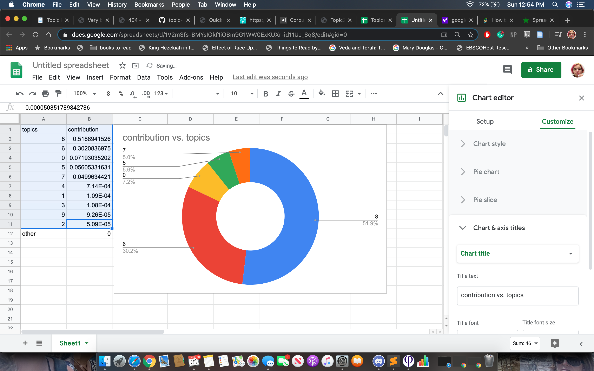

### Excel
- I chose to use google spreadsheets
- I uploaded the .csv file to google drive, then clicked open in spreadsheet
- It was relatively easy to create the graph, and I played around with modifying the display ranges until it looked readable (the auto-generated graph was so zoomed out that the bars barely looked like they were different lengths at all)

### Rstudio
- Generating the graph for this project was also pretty easy— I think I have a sense how to actually design and display it (aka changing the y-axis and x-axis labels with `ylab` and `xlab`, changing the title with `main`), however I would have to pretty carefully retrace the steps here to import the data (or different data) correctly again. 
- I recognized some obvious things that needed correcting in the graph formula as it was given on the website— changing the `main` to `xlab` and the `xlab` to `ylab`. However, I was stumped as to what command to use to change “Edinbugh” to “Edinburgh.”

- I tried to create my own plot 

- I was quite confused why when you `head(documents$Newspaper.Title)` it displays something different from the x-axis newspaper names when you `title <- table(documents$Newspaper.Title)` and `barplot(title)` 

- Opening up the additional pages which were linked at the end of this section on the website, I played around number of articles per year graph, turning it into a line graph instead of a bar one. I feel like this makes a lot more sense for this type of data visually. My mucking about also altered the distances between some of the year labels displayed on the x-axis, for reasons I don’t know
- I also made use of the `col` function, which I could see coming in very handy if I were to display multiple lines on a graph simultaneously.

- I could definitely see myself returning to this and working on it more. 

### Voyant
- This was slow going as my computer seemed to be a bit overloaded. I tried to familiarize myself with the “cdn” excel spreadsheet so that I could have a better understanding of what I was doing, but my computer couldn’t seem to handle the file as the "numbers" application kept stalling. 
- Although I would have liked to examine the original to make sure I was uploading the data properly (it wasn't working when I copy-pasted the url, so I had to upload from file, and wasn't entriely sure if the pre-reveal alterations using "options" were actually working), it did generate a corpus. It did generate something slightly different from the example one, but that may have just been randomizations of colour and placing by voyant. 

- [My Corpus](https://voyant-tools.org/?corpus=922e40b90dee8a99e30d7bd80fe3d05e)

- In mucking around with the data, I created [this graph](https://voyant-tools.org/tool/Trends/?query=men*&query=man*&query=woman*&query=women*&mode=document&corpus=922e40b90dee8a99e30d7bd80fe3d05e) comparing frequency of men/man and women/woman. 

#### Building My Own Voyant Corpus 
- I decided to look at all instances of “shark” that occured on the front page in Florida newspapers (why only the front pages? because that fetched over 3k results and I was worried about crashing something. “Show only ront page” generated only 583 results, a much better starting point.
- It was quite nerve-wracking to have to go back and figure out how to generate the data myself without direct instructions, but I wanted to at least try. 
- The first thing I want to do is save all of the search results on my computer, ultimately as a list of urls in a text file. Since I knew I would not be able to generate a simple formula 
`wget -r -np -w 2 --limit-rate=20k https://chroniclingamerica.loc.gov/search/pages/results/list/?date1=1789&rows=50&searchType=basic&sequence=1&state=Florida&date2=1963&proxtext=shark&y=0&x=0&dateFilterType=yearRange&page=1&sort=relevance`
- That shot in the dark didn’t work— So I asked Discord. The professor seemed to be nudging me towards tackling an easier project, so I decided to limit my search range by date. 
- I tried starting from an arbitrary point, “1800,” and generating just a few results, only until “1810.” This didn’t generate any results, and neither did expanding the search to “1850,” because, as a quick google search informed me, Florida was not founded until 861, thus making it impossible for them to collect data on newspapers published there before that date. 
    - This opened up some interesting questions for me, since surely, people already lived there, news already spread, pamphlets or something similar already existed in some form— but this database doesn’t include it. I certainly don’t have the skills to generate a better algorithm, and I’m greatly on some level that this one is so straight-forward, as that makes it easier to navigate as a user, but you do wonder what information you may be missing? 
    - Note: The first newspaper featuring “shark” on the front page doesn’t occur until 1883, so this still doesn’t entirely account for it— maybe I’m overestimating how easy it was to start a newspaper, or how frequently newspapers talked about sharks. 
- Dr. Graham explained that “view source” (on my machine, control+click on the webpage and “view page source”) brings you to a page which lists all of the urls. Some cleaning up in sublime, and bam! A list of all the OCRed articles we need 
    - while cleaning the files, I got lost trying to figure out how to remove the extra white space, so I googled it, and found [an answer](https://salesforce.stackexchange.com/questions/22169/i-need-a-regex-to-find-line-breaks-in-a-text-area-field-in-salesforce) suggesting this formula: `([a-zA-Z0-9@.:\s*)]+\s?)(.?)$`. It looks like nonsense to me, but it worked like a charm. 
- The final [Voyant Corpus of Sharks!](https://voyant-tools.org/?corpus=a2f3c632ffa3392fc98acea974be5dc7) All of the graphs I generated were quite busy, I think I should have limited the data more. 

#### A Little Extra
- For my own entertainment, I also decided to paste the text of Mary Shelley’s *Frankenstein* into voyant, generating [this](https://voyant-tools.org/?corpus=f5d4ddc56df5bd0f22612075aed01af7) corpus. After removing “gutenberg” and “tm” (because I copied this text from the [gutenberg galaxy](https://www.gutenberg.org/files/84/84-h/84-h.htm), which includes some paratext, I got a lovely word cloud of the most frequent words which occur in this book— “death,” “life,” “friend,” “thought,” “father,” etc. 
- Most of these words reflect accurately the themes of the book. The name of the protagonist’s fiance/cousin “elizabeth” also occurs frequently. Shockingly, there is nothing clearly addressign the monster/creature Victor creates. 
- However, when you graph the frequency of “misery” and “miserable,” you do find, amusingly, that [it increases over the course of the book](https://voyant-tools.org/tool/Trends/?stopList=keywords-a408e20c62bb07e8cf6dcc092a03c206&query=miserable*&query=misery*&docIndex=0&mode=document&corpus=f5d4ddc56df5bd0f22612075aed01af7), as Victor’s family is killed off and he is isolated from the world. 
- I could definitely see myself using this tool more in the future, to identify quickly not just how many times a word re-occurs but how frequently a cluster of similar words occur, and where in the text. 

### AntConc
- starting out, the tutorial takes some time to talk about webscraping, but I assumed for the sake of the first attempt that the corpus I was working from was clean(ish). 
- I was having trouble with this because I didn’t follow Dr. Graham’s advice and limit myself to texts I thought would be interesting, but just loaded everything straight into antconc. Thus it was quite slow work for a while. So, I went back, downloaded the text file of titles, and after doing a few searches, landed on “wife” and “husband” as interesting jumping-off point of analysis— for one, there are over 90 instances of “wife” and only 5 of “husband”
- I tried loading a new corpus under the directory “husbands” with only the 5 files. 
    - NOTE TO FUTURE SELF: you must open and close the app to open a new set of corpus files 
- I generated several searches, “drunk,” “good,” “wife.” (attach?) 
- Next step: comparing corpora-- I chose to compare the “husbands” corpora with just a small selection of the 90 “wife” files, then generated the keyword list: 

- If I understand this correctly, these are words which occur more frequently in the “husband” than “wife” texts (frequency indicated by “keyness”). 
- I can’t say I really know what this tells me, but I definitely feel accomplished that I was able to get it to show me anything! 

### Topic Models 
- I chose to skip adding the metadata file, at least to start
- I copied only a portion of the .txt chapbook images, so that I hopefully wouldn’t have the same slowness problem I had with AntConc. 
- Here's the list of topics:

- Following [A. Wallace’s tutorial](http://miriamposner.com/blog/very-basic-strategies-for-interpreting-results-from-the-topic-modeling-tool/), I generated a pie chart for one of the chapbooks:

- by far the most represented topic is number 8, which I can see correlates to “1 man good god life christ children great mind world nature family make day child time con happy things mrs”
- As I understand it, these “topics” are really just word clusters which the algorithm has found share some likeness with eachother that I should care about. 
- looking at the words, I can some up with loose ideas for what each represents: 
    - 0 =  roman and arabic numerals. Possibly correlates with documents emphasizing dates or other things requiring numbers be listed. 
    - 1 = lots of words which are spelt strangely. I can really *feel* the scottish accent in these ones, but I don’t know what they mean.
    - 2= money? 
    - 3 = “said” and “says” repeated, Fs instead of Ss prominent
    - 4 = geography? 
    - 5 = “man,” “father,” “master,” “king” 
    - 6 = fighting? battle?
    - 7 = young love? 
    - 8 = domesticity / god-fearing 
    - 9 = definitely something to do with religious devotion

#### Looking at Paradise Lost
- Because I felt rather lost examining the chapbooks but wanted to understand the software better, I decided to plug in some data I was more familiar with: Milton’s Paradise Lost. 
- I created a new folder, tmt2, with new input and output folders, and pasted 13 `.txt` files (every chapter plus the front matter as different files, which I copied and pasted from [dartmouth.edu](http://www.dartmouth.edu/~milton/reading_room/pl/note/text.shtml)) 
- this came up with word clusters I had more of an intuitive grip on, for example, I knew that topic 7 would probably be most prominent in the front matter, and that topic 9 would feature heavily in book 9, where eve is seduced— what with its talk of trials and serpents and deaths. Interestingly though, topic 2 featured more prominently in book 9 that topic 9 did—  I wonder if this topic features heavily across all the books, or more in the scenes on earth than the ones in heaven or hell, or if it relates to something else altogether. 
- Looking at the percentages would probably be a better way to think about this,  so I need to take a look at some of the csv files. Looking at the TopicsInDocs file, indeed, “2” is the top topic, making up between approximately 40%-82% of each given book, except the frontmatter. 

- Perhaps the best title for this series of word clusters is simply “miltonic”? The variousness of its occurence is still interesting  as well— it has a much smaller majority in Books 1 and 2, which take place in hell, as Satan and his horde rise from their defeat. In both of these books, topic 4 ("heav thir hell warr fire pain deep satan arms arm battel strength fierce force fight sat foe hope thunder revenge”) also represents a sizeable chunk. 

- In conclusion: I’m curious what this tool could help me do in exploring a given text or cluster of texts, although I feel like I would need to understanding *why* it clusters the words it does before I would really be able to draw interesting conclusions with it. It certainly provides a new and different way of thinking about the structure of a text, breaking down linear chronology in a potentially beneficial way. 

### Topic Modelling with R
- There was no banner but it did ask me to type “yes” into the console to install tidytext.
- I got an error with the line `topicModel <- LDA(dtm, K, method="Gibbs", control=list(iter = 500, verbose = 25))`, reviewed my previous code to try to see if anything else had gone wrong beforehand which I hadn't realized, tried `install.packages('LDA')` just on the offchance, then decided to take a break. 

### Conclusions
The material for this week was quite intriguing and I would love to play with it more (I would have to if I wanted to really understand the ins and outs of it properly, I think). I did often feel overwhelmed working from the data provided, because it was another layer of unfamiliarity. I couldn’t always tell with the scottish chapbooks what was me not understanding the writing conventions of the time and what was bad OCR-ing. I could see this being a lot more engaging if I were working from a personal research project, or if there were a list of different topics to choose from (scottish chapbooks, humanist emails, etc.). Beginning from a place of greater familiarity with the data would have helped ground me with these projects, which is why I included “little extras” where I looked at texts I felt more familiar with. Although the “extras” I chose were mostly just books, I would also be very curious to know what different types of data can be tackled with these softwares. 
